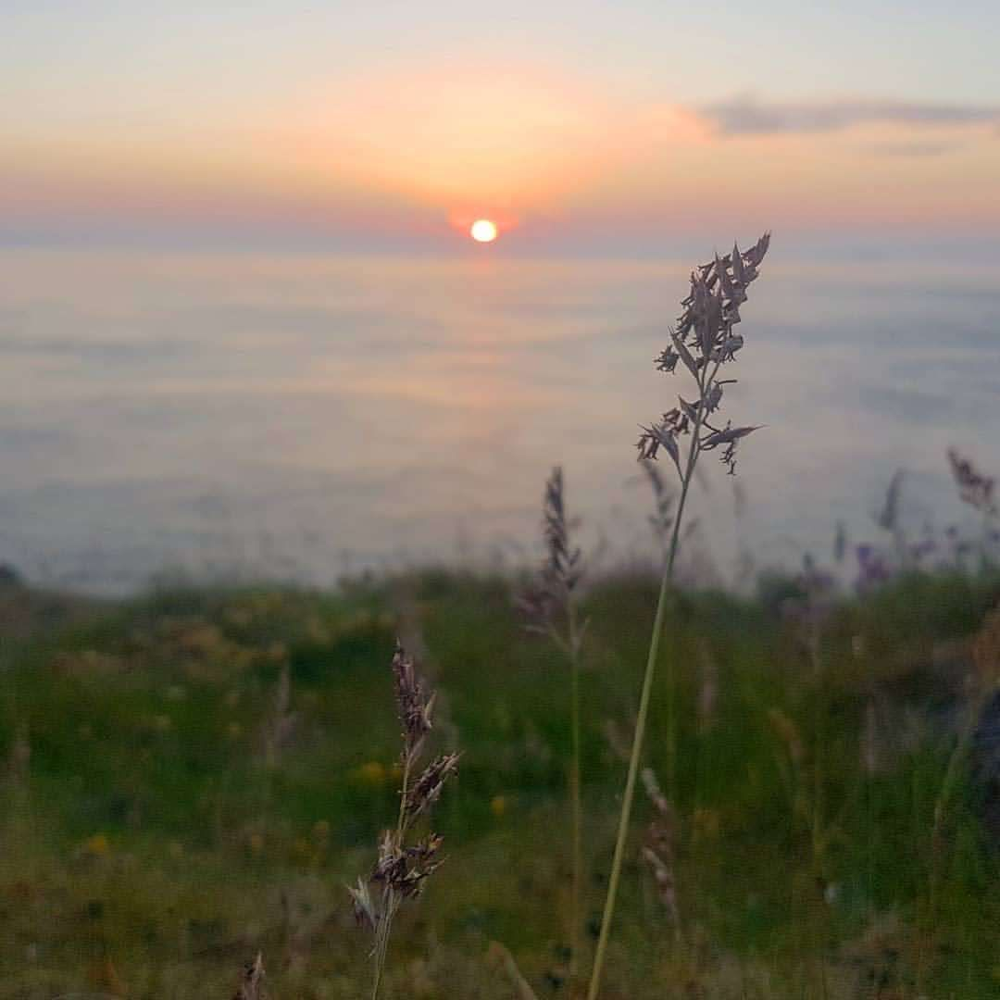

- Distance: NA km

Day 2 of Sea Kayak Anglesey Intromediate course with Stu Leslie.

Headed to Rhoscolyn (very impressed watching Stu get the trailer down there 😅). Paddled out to the beacon to see the seals, then into the cliffs for some rock hopping and watching some folk climbing.

We finished with some theory on tides (springs/neaps) back at Anglesey Outdoors in the Paddlers Return.

I drove home realising I wanted to do a lot more of this sea kayaking thing, and vowed to look up Lancaster Canoe Club when I got home.

