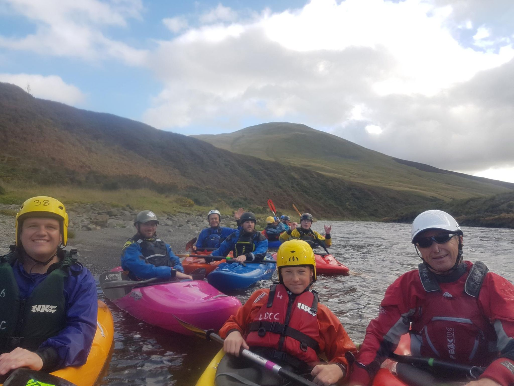

- Distance: 8.9 km

Paddle from Tebay to Lowgill. 

Paddle Report for Sat 28th Sept. Paddlers on-board :- Lucas, Dan, Rhian, Gregory, Holly, Steve, Alan, Darren, John, Rowan, Simon, Paul. After the recent deluge, the levels had dropped overnight and the upper upper Lune was chosen as our playground. On the drive up to the Tebay start, there was more blue sky showing than was forecast. After the shuttle, we all got onto the swift flowing water breaking the journey up by regrouping in eddies or for the occasional re-seating of a swimmer. With such so much sunshine, warmth and wind free, it was hard to believe this is our first winter journey of the year. 


It was great to see everyone working hard on their breaking in / out, and paddling control skills. Getting out at Low Gill was made a little more difficult by picking our way through the fencing erected to enable works to be done on the bridge. This work is scheduled to last 8 weeks but not date was given. Thanks to everyone for making a good day great.

