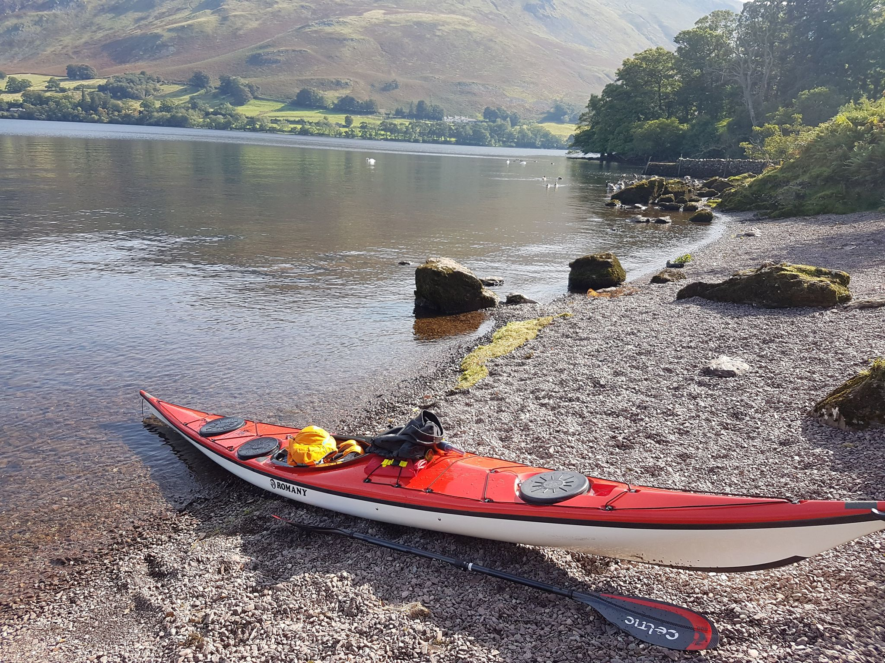

- Distance: 16 km

First solo paddle. I parked at Ullswater Steamers, and James helped me carry down to the slipway, before heading up Helvellyn. Just as I set off, I spotted a ferry coming in to the pier, so had to paddle hard to get to Cherry Holm. After catching my breath, I headed north along the east side of the lake. I passed a small group attempting to paddle the gap between Lingy Holm. Past Silver bay, and then a long strech along Birk Fell, which I used to practice efficient, fast forward paddling. I stopped for lunch near Howtown, after doing a bit of litter picking. On the paddle back south, I stopped at Norfolk Island for a hot drink and to look at the view. The southerly wind had picked up a little, making progress a little slower. I did two loops through Lingy Holm gap, and looped around Wall Holm before landing back near the ferry pier. An excellent first adventure - next stop a solo sea paddle!

