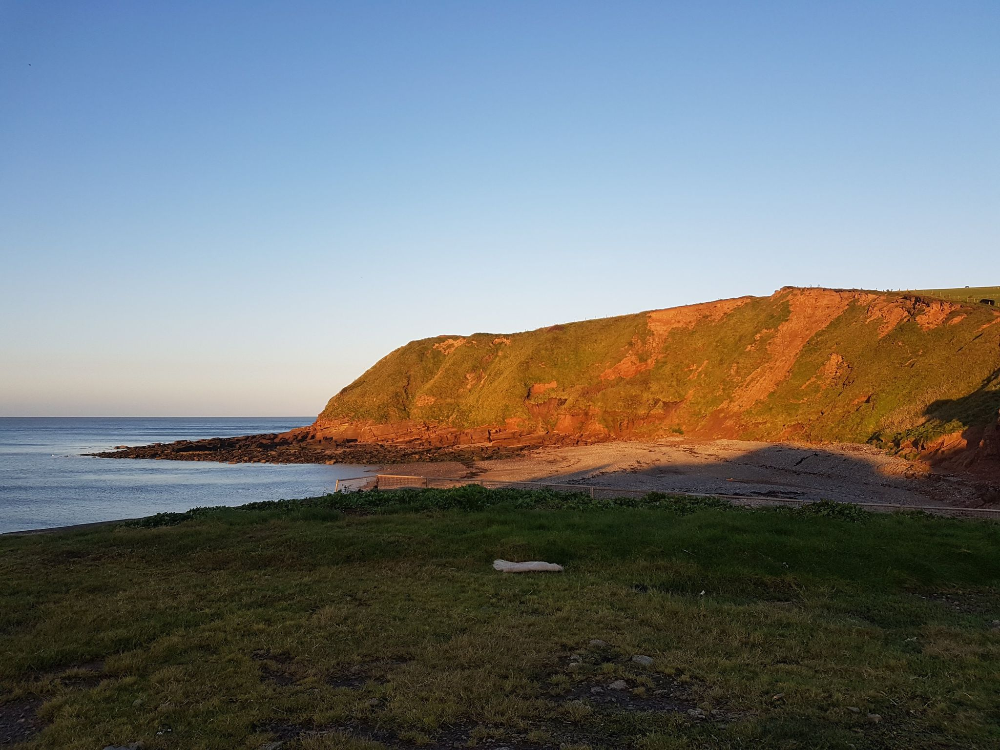

- Distance: 14.2 km

Thankfully, the wind was lighter on Sunday, and we headed North. We stopped at Fleswick Bay for a coffee & snack. I saw a seal (possibly the Fleswick bay seal). We started heading towards Whitehaven but some of the group were struggling with the speed, so we stopped for lunch on the rocks at Saltom Bay. We slowly and gently paddled back to St Bees slipway, and popped to Hartley's for tea.

