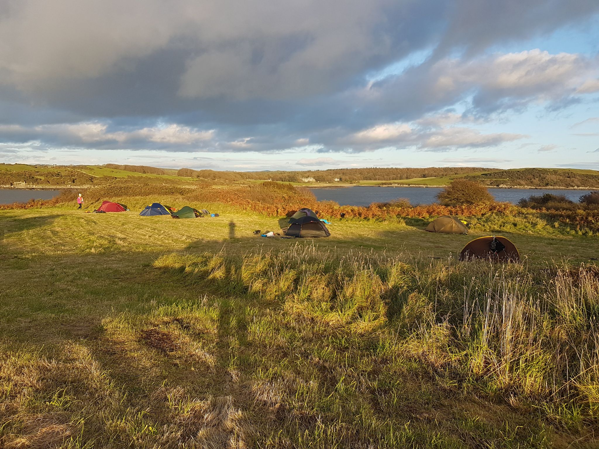

- Distance: 14.2 km

CC event led by Alan & Gina. Other paddles were Bob, Elspeth, MIke & Graham. We set off from the slipway at Auchenlarie. It took an hour of so to load the boats up as it was our first time kayak camping and people had brought lots of stuff! There was a stong westerly wind, so we paddled west into the wind first, before turning around and making the most of the following sea. We stopped at Mossyard beach for a quick lunch, before turning into Fleet bay. We crossed the bay at a narrow point, and then followed the coast heading towards the island. It got quite choppy with big swell, which I enjoyed, however Elspeth was quite scared and was shouting swears as apparently she gets angry when she gets scared! We landed on the island, unpacked and started setting up camp. I went for a walk whilst the boys catch some fish. We had a bonfire on the beach, cooking sea bass on the fire, mussels, stick bread and apple crumble parcels (complete with forged blackberries!) A fantastic evening, and an incredible dark sky.

