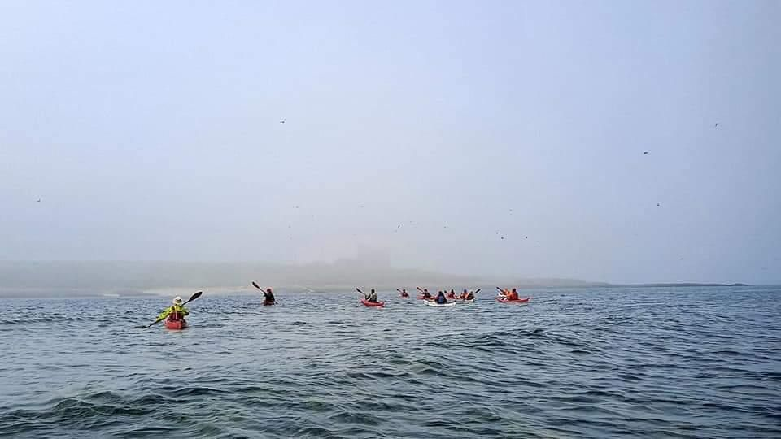

- Distance: 13.8 km

A weekend of paddling on the North East based from the campsite at Budle Bay. We were hoping to make it out to the Farne Isles, but the weather was not looking promising. Photos by Kirsty 

On Sunday, we attempted the crossing to the Farnes. It was very misty and there were tourist boats out so we radioed the harbour master to let them know about our crossing. It was fairly choppy on the paddle over and we were paddling on a bearing. It was a relief to see the Inner Farnes appear out from the mist. Paddling around the Farnes, we were able to get pretty close up to the cormorants and puffins. We didn't stay too long as the weather was due to change for the worse in the afternoon. The paddle back to the mainland was much quicker, due to the tides and a following wind. Again it was really misty and it was quite spooky to suddenly hear voices and see the beach emerge from the mist. We had a damp lunch on Bamburgh Bay, although it was so misty we couldn't see the castle! Before getting off the water at Seahouses, we practiced playing the surf and bongo sliding.

