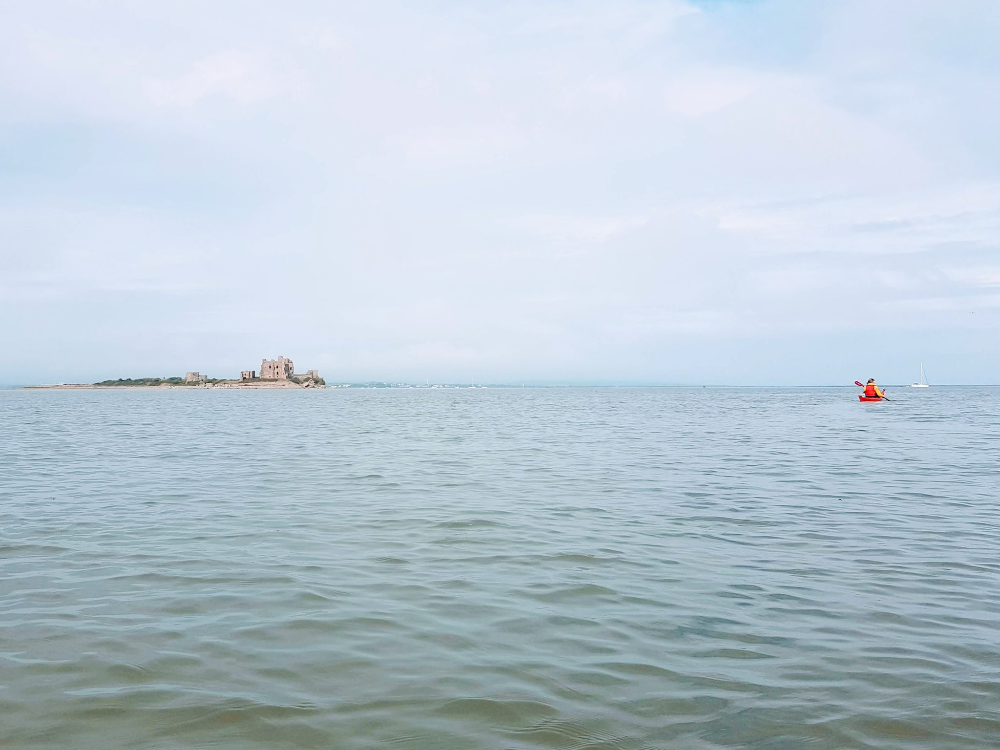

- Distance: NA km

Supporting Cumbria Canoeists Introduction to Sea weekend

Two days of paddling from Roa Island Boat Club introducing 20 new paddlers to the sea. I was helping as an assistant leader with Mike Sunderland taking two family groups out around Piel. (HW 13:30

We got on the water at 10:30 from the Boat Club. We did some skills in the channel, feeling the effect of the current and practising turns around the buoys. We paddled under the RNLI Lifeboat station, and paddled along though the boats before crossing to Piel island. We had lunch by the castle, and then crossed over to Walney. We tried to practice bow rudders, but the seals had other plans! They were very inquisitive and kept popping up behind us. We went around to the southern tip of Walney to the seal colony, keeping our distance. We paddled back to Roa Island, crossing the shipping channel. The sun came out in time for drinks at the RIBC bar. (HW 13:30)

