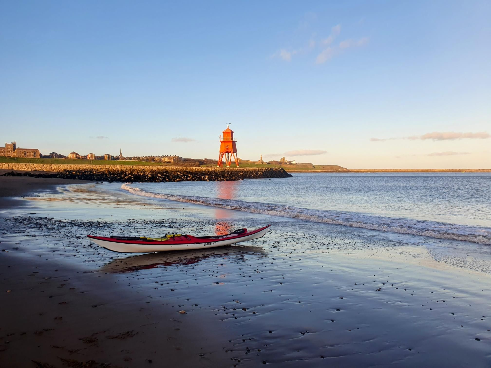

- Distance: 25.9 km

Tidal flow, a tailwind and good chat made the kms fly by.

The shuttle to South Shields and back took ages because of Monday morning rush hour traffic and that someone accidentally left a paddler at the get off!

We stayed at the Travelodge the previous night, and the get on was just behind the carpark which was very convenient. Although we did have to dash across the railway line. 😬

