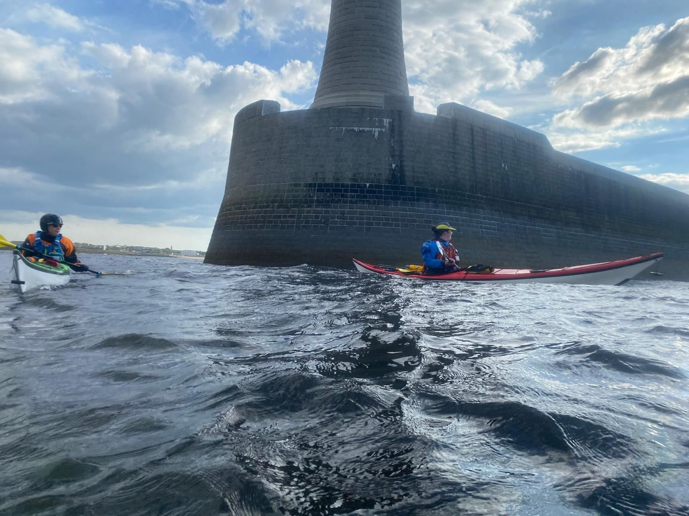

- Distance: 6.9 km

A quick after work paddle. We popped out of the piers, but the conditions were quite big. We sat and watched some dolphins and then headed back into the safety of the piers before the tidal race picked up. We paddled into the Fish Quay to extend the evening a little before heading back to the rowing club.

