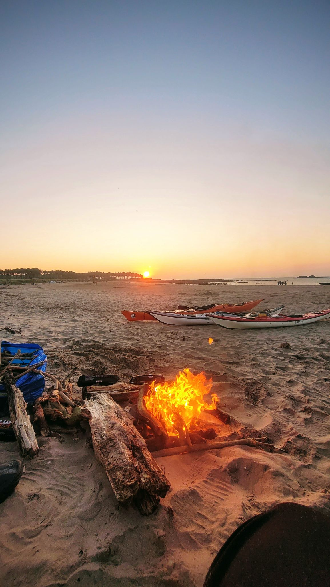

- Distance: 10.3 km

A last minute getaway at the end of August with Pal, Sarah, Phil and Mark.

Winds were higher than we expected when we arrived, so we decided to set up a "just-in-case" shuttle.

Paddled along the coast, underneath Tantallon Castle.

We camped at Yellowcraig sands. Sarah & I had a swim. We walked to find some wood (and treated ourselves to an icecream from the van - luxury!) and then we watched the sunset from around the camp fire.

