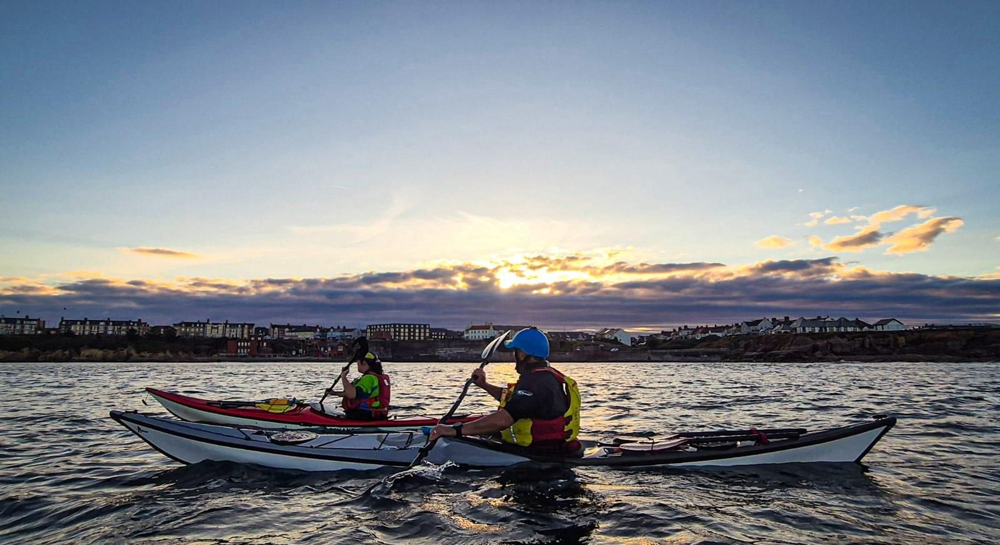

- Distance: 11.9 km

Paul, Kev, Claire, Cath, Mark and Gordon 
Dave setting off a little late and meeting us on the water. 

High tide and not much swell

Tide was ebbing as we came around the piers which meant a little effort was needed to get back into the mouth. 

We put a little speed on for the sprint along the wall and into the Haven 


📸: Kev Thompson

