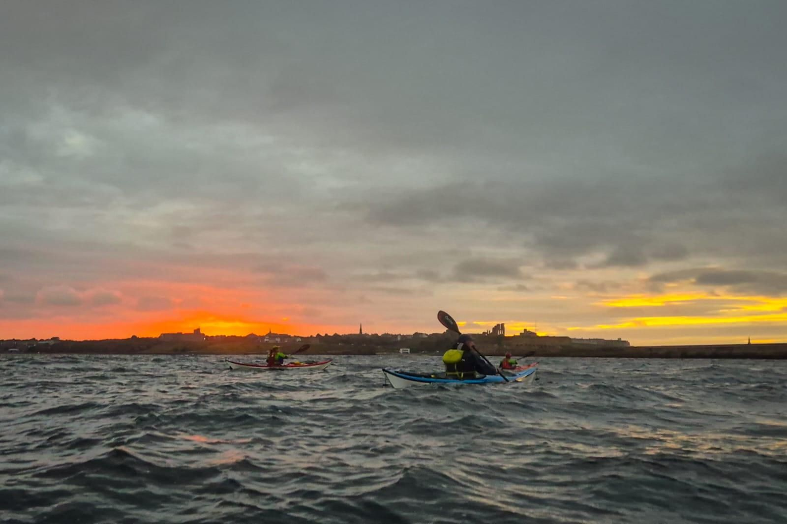

- Distance: 10 km

Making the most of evening light we headed South tonight (Paul, Sarah, Cath, Claire, Kev, Mark). Chased the DFDS out between  the piers. Slight tide race off the North pier. 

Quite choppy and a good height (5m) for playing in rock gardens between Trow & Marsden.
 
Two Shields youths entertained themselves by throwing rocks at us 🙄

Mick caught us up for some rock hopping before we headed back around South pier at sunset.

