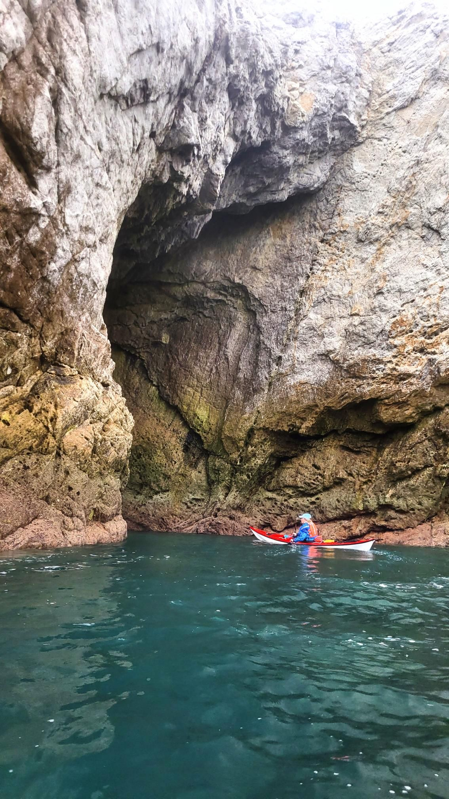

- Distance: 12.1 km

The day after our tidal race course, Paul, Sarah and I did a short paddle from Porch Dafach.

Paul Williams suggested that the arches Bwa Du & Bwa Gwyn were worth a look. 

I practised my navigation skills on the way home as Porth Dafarch isn't obvious to spot.

