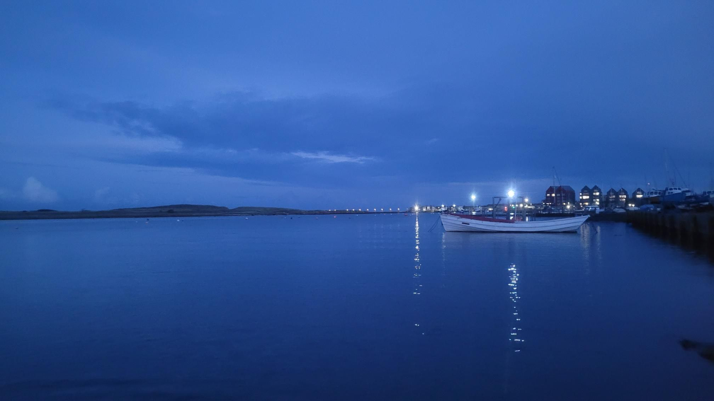

- Distance: 10.2 km

A very autumnal afternoon 🍂
Pootle up to the weir and back. Saw a sleepy heron. And lots of lapwings.
Paddled up to the harbour to watch the big waves breaking.
Got chips and curry sauce before 😋

With Kirstie, Sarah, Paul, Ann, Pauline, Julian, Chris & Dave F

