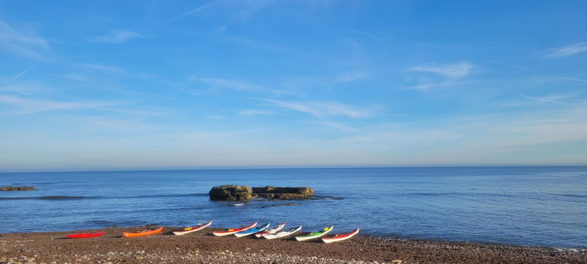

- Distance: 18.1 km

Initially the fog was heavy, and we considered just paddling North, rather than cross the channel in the fog. However, by the time we were getting on the water, the fog burnt off. 
 
We stopped for lunch at Souter point. On the paddle back a mega wave broke near the arch. 

With Paul, Sarah, Dave, Gail, Tim, Tony, Mark, Pauline.

