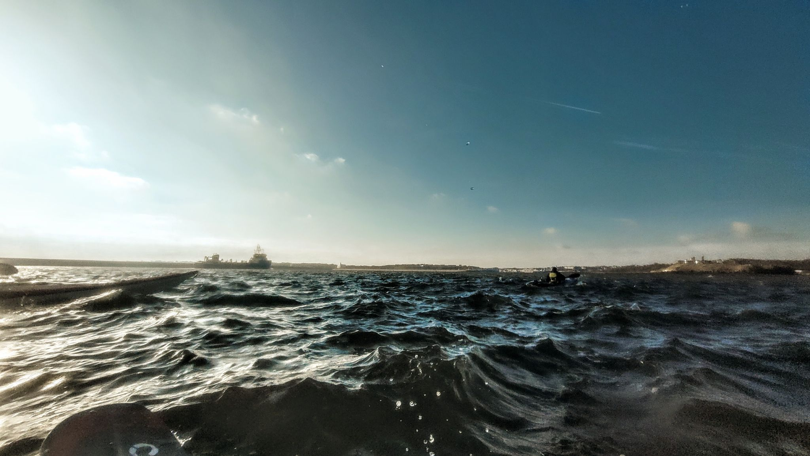

- Distance: 8.5 km

Just me, Paul and Sarah out for a short paddle before the swimming pool session. I had really bad cramps and it hurt to sit in an upright paddling position so I paddled very slowly. 
It was low spring tide and so a lot of the pier that I couldn't normally see was exposed.
Followed by chips at Oswins 😋

