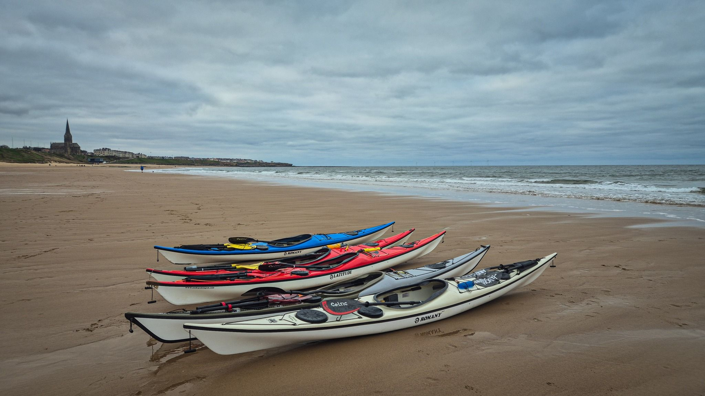

- Distance: 10.2 km

Short session tonight to give our novices a chance to paddle from Longsands. We had two capsizes, one at the north end of Longsands, and one as we came in to the surf-landing.

I also fell in on a baby wave trying to practice surfing at Longsands. Paddled around the piers with Sarah, Paul, Kev & Mark, and made it back to the Haven in the last of the light.

📸 Kev Thompson

