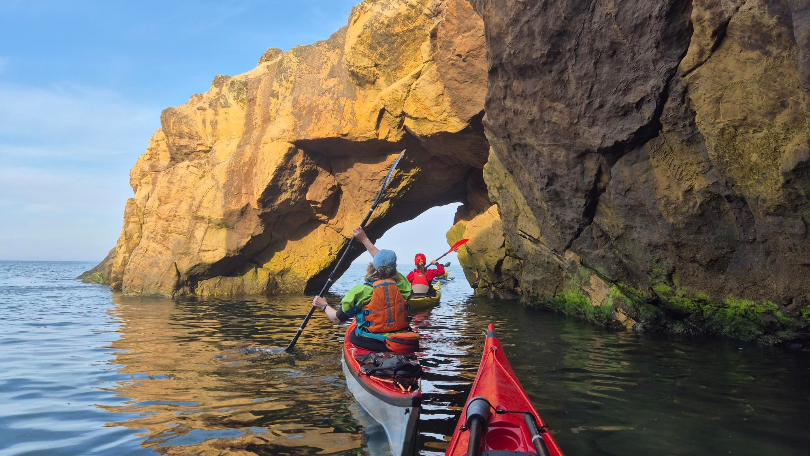

- Distance: 11 km

Three novice paddlers joined us at Longsands.
We took them to Cullercoats arch to practice draw strokes. It was a big springs (5.3m) at high tide so the arch was quite small.
One capsize quickly resolved once Stephen had been contact towed away from the rocks.

Saw the RNLI practicing landing in the tractor cage. First shorty cag of the season ☀️

