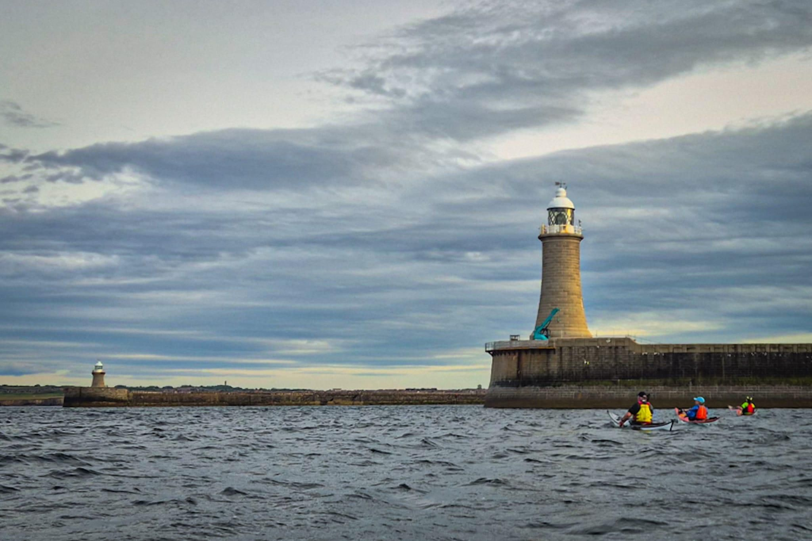

- Distance: 7.7 km

Quick after work paddle with Sarah, Kev & Mark. Quite choppy around the piers.

Paddled to Cullercoats bay to do some rolling practice. Had one fail but after a bunch of encouragement and a "just do it" pep talk from Kev managed one successful roll. 

Getting there slowly...

Also I noticed that I enjoy lumpier conditions more when I smile :D

📸 Kev Thompson

