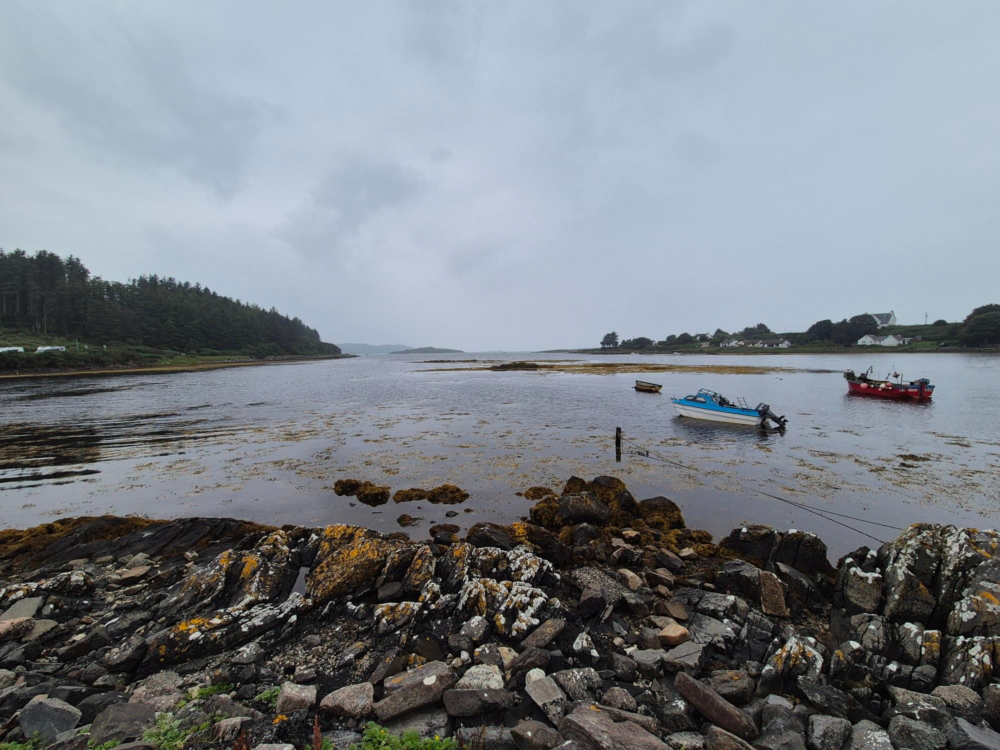

- Distance: 15.4 km

The wind was forecast to be F4+ and gusting so we planned a downwind run along to Bunessan. A slow start OTW 13:30 to avoid stronger winds in the morning. There was quite a bit of clapotis in the Sound of Iona, but much less action off the north west corner than we were expecting.

I practiced my nav, correctly identifying some of the smaller beaches  and islands. 

We decided to go via Eilean na Liathanaich Light. We got a lot of wind assistance by being just a little off the coast and did the 1km crossing quickly. 

Paddling across Loch na Lathaich into Bunessan the group split up a bit, with paddlers rushing to cars. Although conditions were calm, a little squall picked up with wind rushing from Loch Caol, and it got busy as a few RIBs came in quickly. Kirstie pointed out that the group dispersing that much would be a fail if I was doing my SKL assessment which was a useful reminder.

Had a pint and chips at Bunessan whilst we waited for the shuttle.

