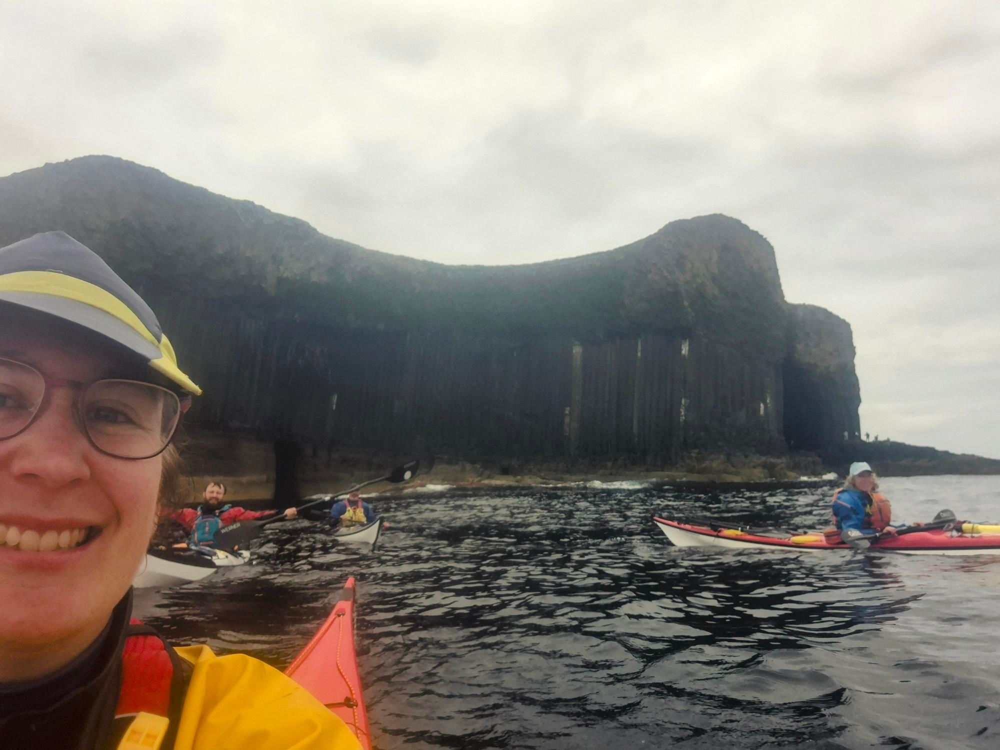

- Distance: 19.8 km

Saw a minke whale, dolphins and porpoises on the paddle out. On the return we saw a pod of common dolphins doing some high breaches and watched the shearwaters skim over the glassy water.

Started my watch late. Actually about 22km.

