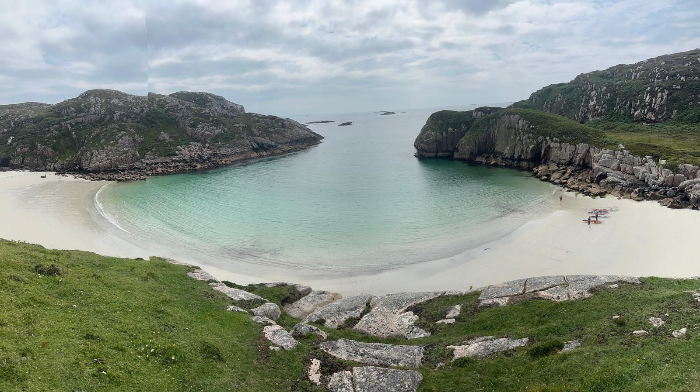

- Distance: 8.3 km

A slow start and an easy paddle around to this beautiful beach.

With a bit more swell it was quite different to when we paddled it a few days before.

We did a bit of micro-nav practice to locate the beach. Much easier on the 1:25000 maps.

Paul, Sarah, Cath, Claire and Mark all practiced rolls and rescues. I wanted to stay dry so I floated and watched.

