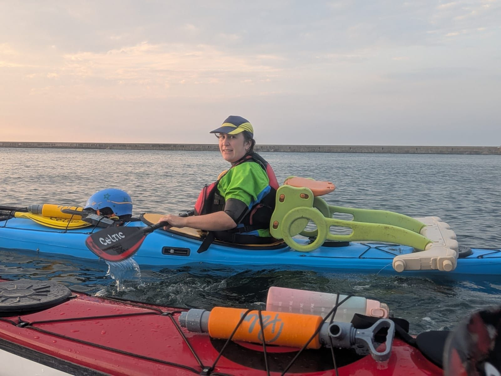

- Distance: 12.3 km

Paul, Sarah, Cath, Claire, Josh and I set off from Haven. We met Kirstie and Gayle at the South pier. 

It was quite choppy once we got around the pier (wind against tide). The water level was a little too high for any decent rock hopping, with many of the caves full of water. We did a loop of the rock, watching the kittiwakes and then headed back to the piers. We had to wait for one of the wind farm ships to pass. I litter picked a large plastic slide which was floating in the Tyne. It was surprisingly tricky to paddle with it on my back deck as it was very heavy and kept putting me off balance.

Pretty sunset as we came back to the Haven. Sat around in the evening to watch the moon rise. Feel lucky to be able to have this as a local evening paddle.

