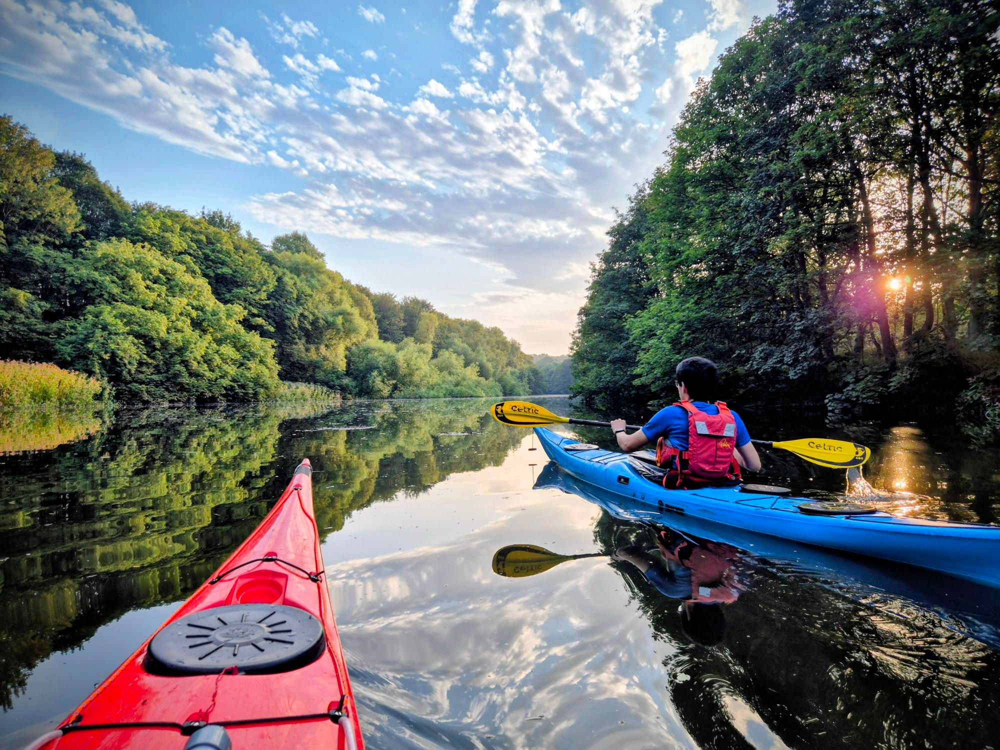

- Distance: 6.4 km

Evening paddle with Keith to Lambton castle. We got on at the Fatfield slipway an hour before high tide. It was a spring tide so plenty of water.

When we got under the A182 we spotted a wildfire starting to spread, so I rang the fire brigade and floated on the water watching until they arrived to put it out. 

As we paddled to the Lambton estate the tide began to turn, so once we spotted the castle we turned around and headed back getting a nice ride with the ebb. 

We had a little detour to explore a little tunnel near Fatfield bridge. Lovely evening.

