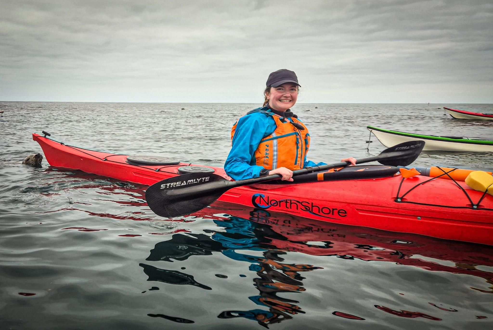

- Distance: 10.3 km

The seals were so good we had to go around twice. 

15 paddlers out in total, Paul & Sarah took three new paddlers (Kane, Sarah & Jonny) around once. I helped run the peer trip with the rest. Conditions were very calm on the west side of the island, so we could just sit and float, surrounded by curious seals pups.

📸 Kev & Josh

