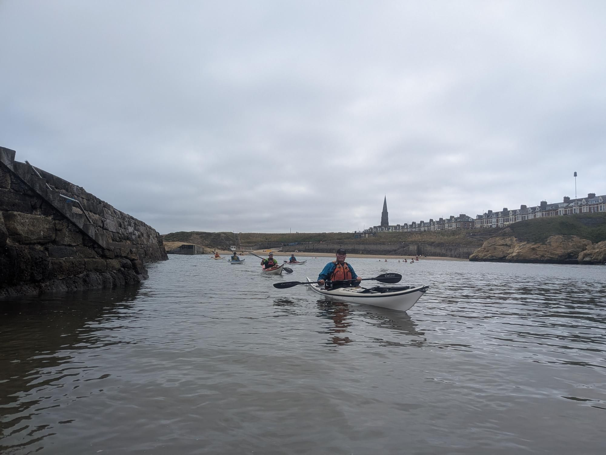

- Distance: 12 km

A relaxed paddle to Whitley Bay and back with Paul, Sarah, Cath, Claire & Kev. We stopped at Cullercoats for a coffee & breakfast rolls.

There was some nice surf at Longsands. I didn't feel up to playing but everyone else got stuck in. Some impressive rolls in the surf, unfortunatley resulting in a lost pair of glasses.

I did one successfully roll on the way back in. No one in a rush to head off, we sat in the sun for an hour whilst our gear dried. It's always good to get out.

