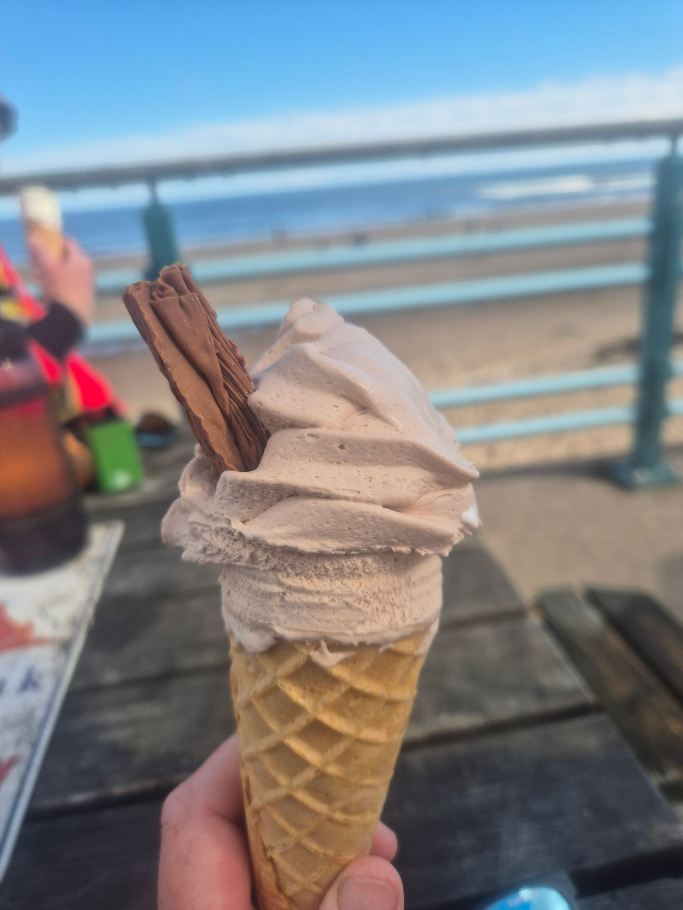

- Distance: 9.2 km

A welcome slow start on Sunday morning, 11am OTW. My first paddle in a month after a busy few weeks. I felt sluggish paddling across Longsands Bay. There were some nice waves but I decided to sit and watch Rich play in them rather than join in.

We stopped at Whitley Bay for ice-cream (after surviving the large queue)

Getting back on at Whitley Bay, the surf was quite dumpy, so I waited and got lucky with a small set.

With Paul, Sarah, Mark, Kev & Rich.
Started my watch late - actually 12.5k total.

