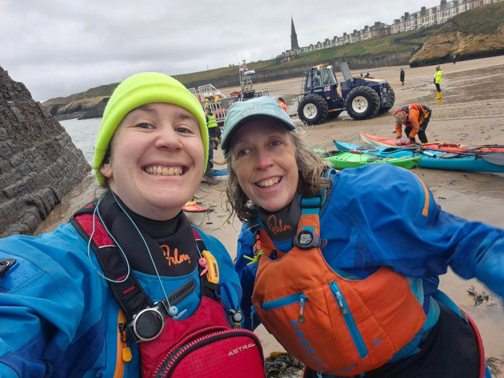

- Distance: 8.5 km

This was my first paddle in over two months so I was just really happy to be getting out. November was busy with work and then the weather has just been too big for us to go paddling. 

As usual Paul and Sarah were out. We were also joined by Stephen, Lorna and Stuart. 

Conditions around the pier were not as bad as we thought they might be but we had a big rolling swell all the way to Cullercoats. Stuart had a swim on the paddle over and I put him back into his boat. We stopped at Cullercoats for a snack and a chat with the RNLI. They were launching to scatter some ashes in the bay and so they made sure we were out of the way so we didn't get a face full! The paddle back was much easier, paddling into this waves. We had a hot chocolate on the beach and then me and Sarah went for chips. It's so nice to be paddling again. I've missed it.

