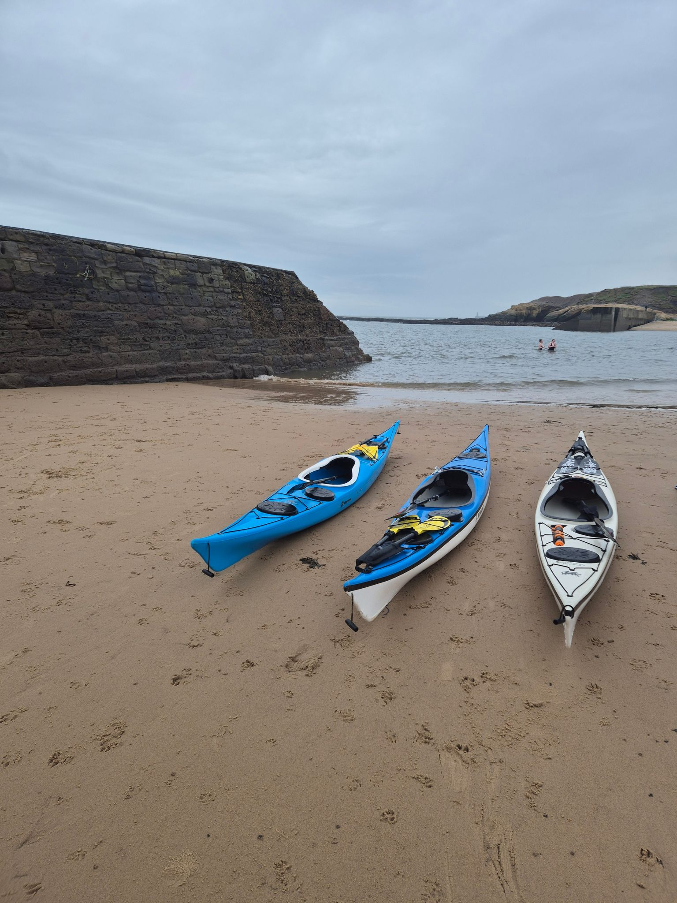

- Distance: 9.6 km

Sat in the Turks Head on Friday night, checking surfline I suggested a Saturday morning paddle. 12 hours later and Kev, Paul, Dave, Tim, Tony and I were ready to get on the water on a grey January morning. 

The swell was a little bigger than I predicted it would be. We surfed the following sea, and just about scraped through the gap in the islands to get to Cullercoats. We poked our heads around the corner at Brown's Bay but decided to turn back.

 A short coffee stop at Cullercoats (in between the dippers) and then back into the swell to the piers. We hit the piers at the middle of the tide and the race was in full flow, which gave a bit of fun (or concentration for me!)

Chips & curry sauce at Marshalls.

