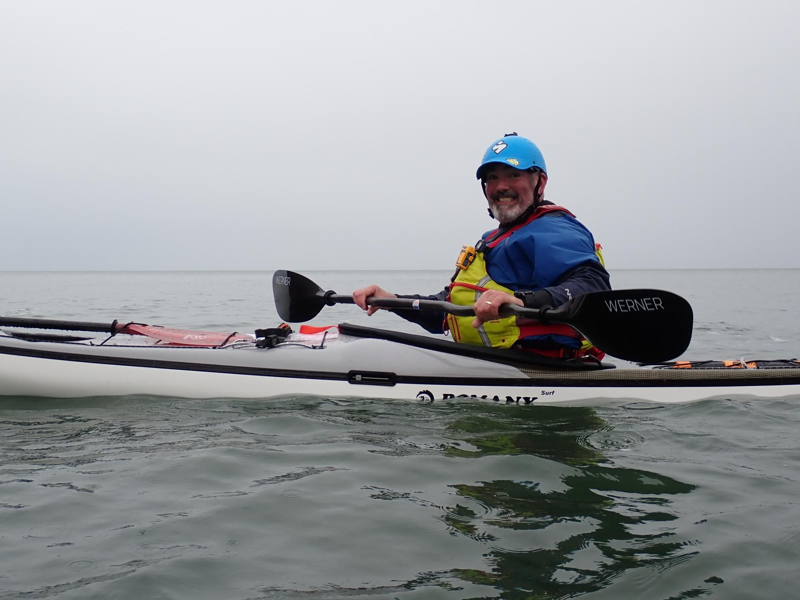

- Distance: 9.6 km

Great day out. Big congratulations to two of my favourite people to paddle with for passing with flying colours ❤️ 🎉

Matt Haydock ran a brilliant assessment. Really enjoying being guinea pig with Cath, Kev & Felix.

Highlights included a rocky landing at Marsden and Kev's Oscar winning performance of "man-with-dislocated-shoulder-gets-hypothermic"

