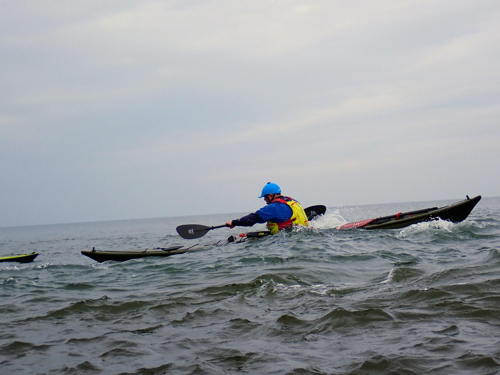

- Distance: 12.2 km

Calm seas and sunshine made for a perfect start to the year with Tynemouth’s first club paddle. With newly qualified leader Mark and Paul guiding the trip, we (Clare, Kev and I) headed around to Longsands to meet Kane, Gary and Anne.

Clare was glad to be out in gentle conditions, recovering from a shoulder injury. It was also Gary’s first time paddling on the sea, he did brilliantly and handled the breaking surf with confidence.

I spent some time practising in the surf at Longsands and noticed how much more stable it feels to ride just behind the front of the wave rather than in front of it. Definitely something to keep working on.

The tide race was just starting to form as we rounded the North pier lighthouse.

