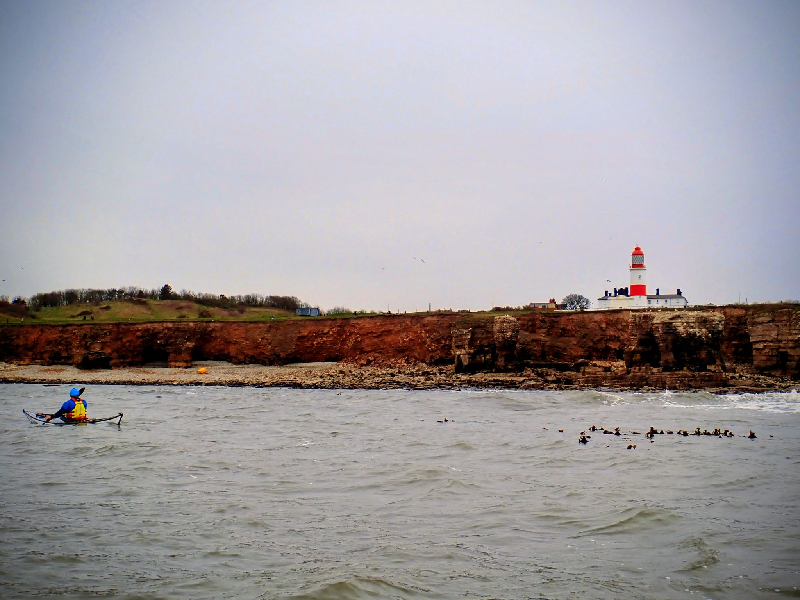

- Distance: 11.9 km

Storm Dave meant no big Easter adventures. However, we managed to get a little South Shields jolly in on Saturday morning before Storm Dave hit. 

We got on at South Promenade rather than the usual Trow Rocks to avoid the climb up the sand dunes after paddling. 

Out to play was Paul, Sarah, Mark, Kev P, Felix, Colin and Steven. The tidal height wasn't right for exploring the caves (the arch was dry!) and so we just paddled down to Whitburn and back. Fuelled by Mark's creme eggs at our lunch stop.

Just as we were leaving the bay and heading around the rocks I thought I spotted a funny looking seal. It turned out to be two wetsuit clad swimmers miles out getting in some training.

