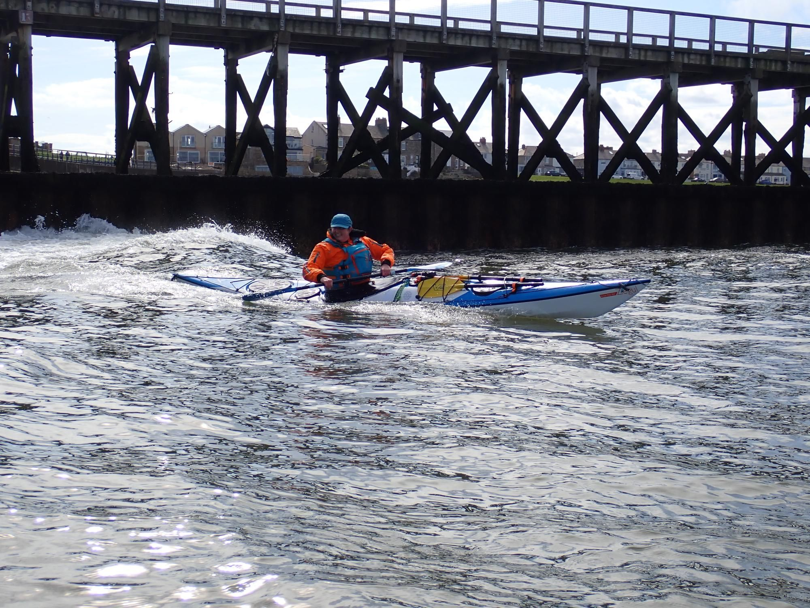

- Distance: 9.4 km

Launched a couple of hours before low tide, so we stuck to the ramp to avoid a muddy start. We had high hopes for puffins and dolphins...  no dolphins this time, but we did spot a few lone puffins (not quite out in full force yet).

On the crossing to Coquet island we admired the new buoys, a North danger marker and a red buoy.

We kept a wide berth around the back of the island with breaking swell over the reef, and loads of seals hauled out on the rocks. 

On the paddle back to Amble we drifted for a while to watch Sandwich terns dive. By the time we reached the piers, the surf had picked up, so we had a bit of fun catching waves in. Even the fishing boat coming in was getting a decent surf on the waves.

In the harbour, Kirstie spotted an old tangled pot with half a dozen tiny crabs stuck inside. None were big enough to keep, so she freed them (and took a pinch for her efforts 🦀).

Finished off the day with chips and mini chocolate eggs. Lovely Bank Holiday Monday.

