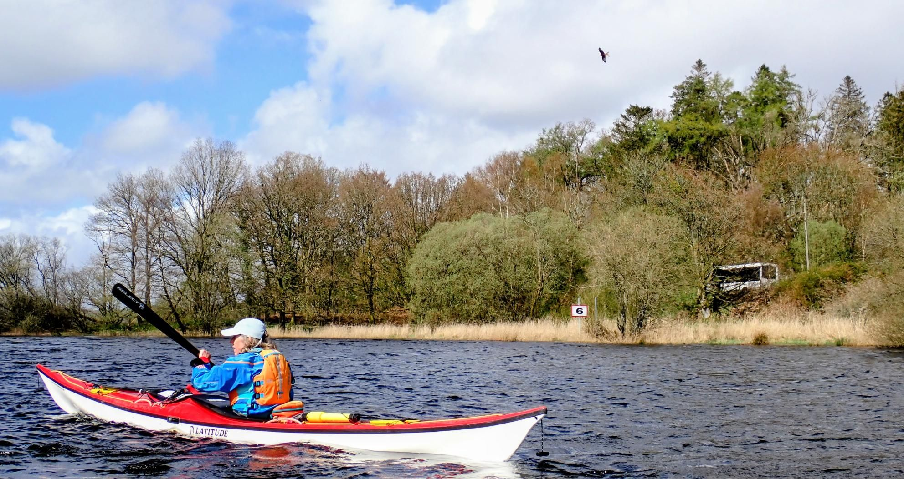

- Distance: 8.6 km

Annual Loch Ken camping trip. Quite windy so we stayed around the estuary and did some skills. 

Lots of red kites around. 

Got moved on from our original lunch spot by on of the powerboating folk.

Tried out our Reed storm cags over lunch.

