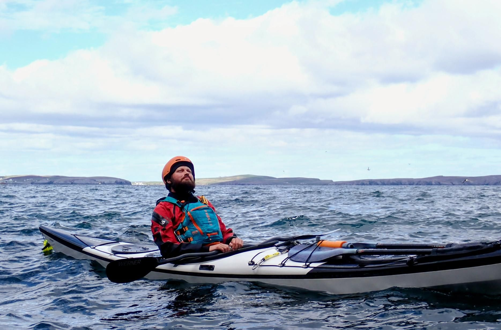

- Distance: 16.2 km

With a strong Northernly wind forecast all day we planned a down wind run from Levenwick to Grutness. 

We handrailed the coast making the most of the ample rock hopping and bird spotting including puffins. There were lots of caves on the way including a couple of really deep ones. After lunch at Troswick we paddled through a couple of natural arches and a cave that was pitched black with a little cut through at the back. 

We paddled past Sumburgh airport and enjoyed watching helicopters and planes land on the picturesque runway. The sea state had been much calmer that we expected all day -  and I was tempted to continue on around Sumburgh head. However, we agreed to call it a day at North Voe beach.

