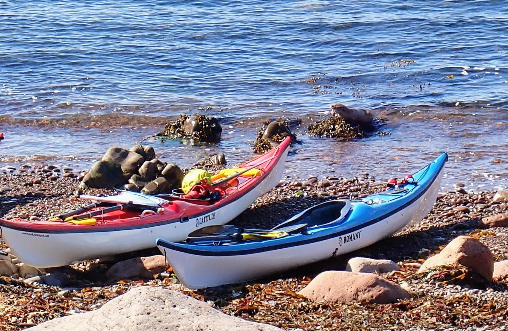

- Distance: 20.7 km

With the best conditions of the week forecast (F3 rather than F5), we set out to circumnavigate Muckle Roe.

The first 6k flew by, easy paddling and a pretty sandy beach for lunch. Next we were on the look out for the Hole of Hellier - a deep cave system with tunnels connecting them. Some of the best caves I've been in.

As we turned the corner to head up the West coast we hit the swell. 1.5 m waves and lots of clapotis meant a choppy but fun paddle.

We stopped at North Ham bay and were delighted to see two otters playing in the bay, one caught a fish. 

So many amazing caves, a stunning coastline and great conditions. I can't believe it was snowing when we planned it this morning!

