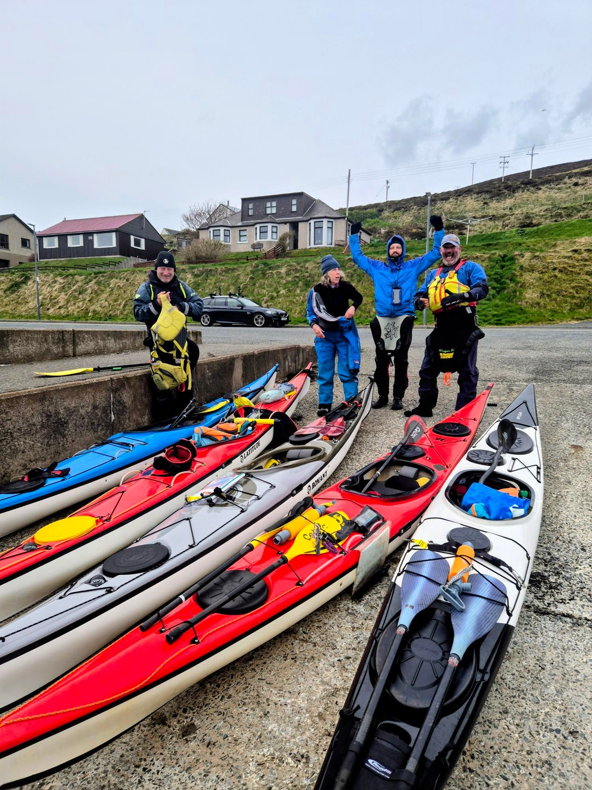

- Distance: 8.8 km

With F6 gusting F7 winds forecast, we planned a downwind run from Scalloway to Nesbister. 

It was hard work against the wind to get out of Scalloway bay, but once we were out in the open we just turned our bows downwind and surfed all the way home. 

Despite the strong gusts, the waves were at a really nice level for confidence building. It's much easier to go for it when you're not scared of getting trashed on the beach.

I was surprised how much fun I had catching waves, especially as I wasn't sure we'd even get a paddle in today.

