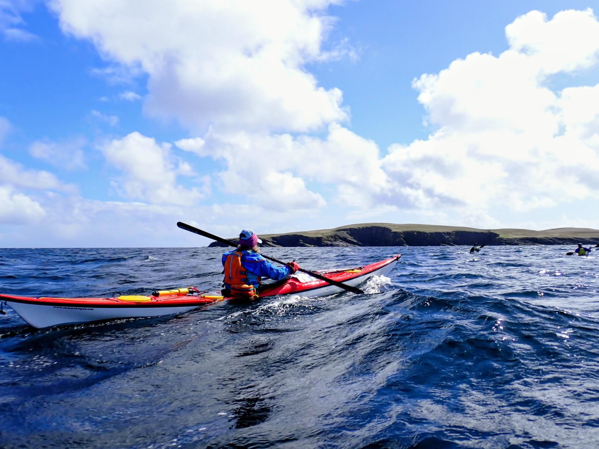

- Distance: 11.1 km

Last day on Shetland. After a no-paddle day yesterday (F8!) we were keen to get one last little paddle in. 

With F4 westerly we were hoping to get a little shelter on the east coast. 
We set off just before the Mousa ferry. Great view of the Broch and plenty of birds, seals and rock hopping.

The way back was a bit of effort into a headwind as expected but it was only a 1km crossing and we were back at the ferry terminal in no time. Great to get a last little paddle in before home.

