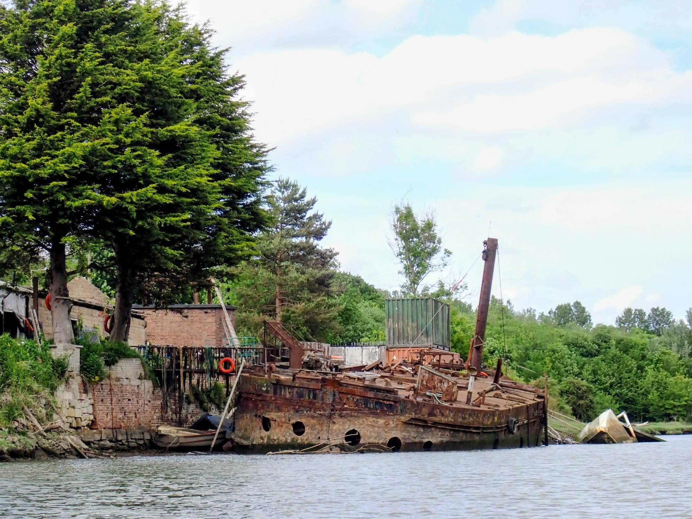

- Distance: 15.7 km

I've been meaning to paddle the Wear for ages. I rescued 2 footballs whilst paddling the tree-lined Washington stretch. Then past many shipwrecks, under Northern Spire, past the Stadium of Light and through the centre of Sunderland. At Roker I sat and drifted watching the porpoises. And then I gave a tow to a SUPer who was struggling to paddle back to the beach against the strong off shore winds.

