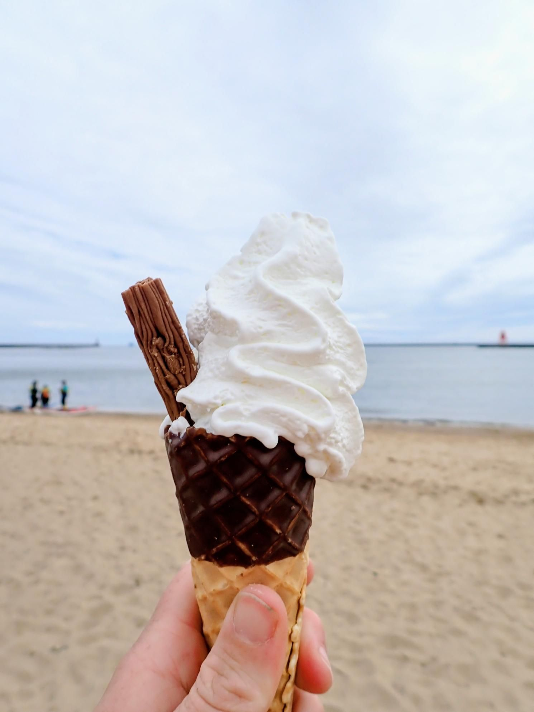

- Distance: 6.3 km

A short Sunday morning paddle with Paul, Sarah and Mark. As we rounded the end of the pier, Mark summed things up perfectly: "Well, there's the wind!"

The sea had been sheltered alongside the pier, but around the corner we met a short, steep northerly chop. With both the wind and tide building, we only paddled a little way towards King Eddy before turning back, knowing conditions off the pier would become much livelier over the next hour.

We then headed up the river, passed the vehicle carrier Cerulean Ace, picked our way around the shallow rocks of the Black Middens, and stopped at the Fish Quay for a well-earned ice cream.

