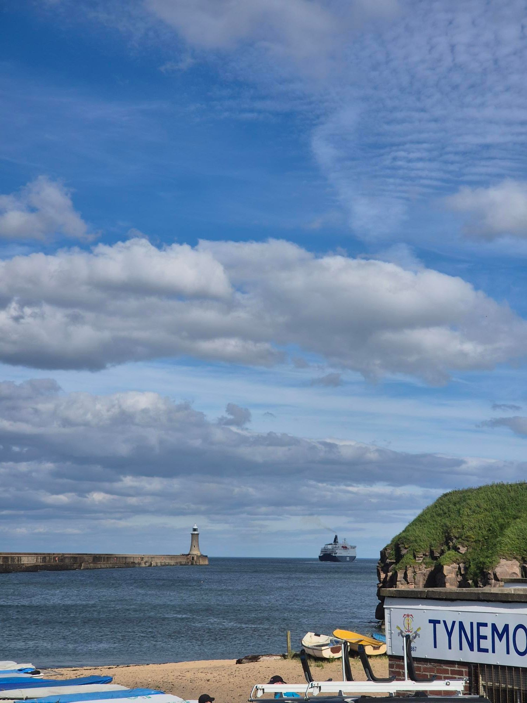

- Distance: 11.7 km

It's been a hectic week, and I almost skipped paddling, but with the sun shining I made it down to the Haven for a half-five launch on a spring high tide.

A big group tonight: Paul, Kev, Mark, Gordon, Kane and Stephen, with Kirstie joining from South Shields. The extra water let us paddle over the Cullercoats reef and get washed up and down the piers.

Lots of kittiwakes and gannets feeding, but no dolphins or whales tonight. When we got off the water at 8pm, the temperature was still at 22°C . Exactly the midweek mental reset I needed.

* Insert running/cycling/climbing etc here

