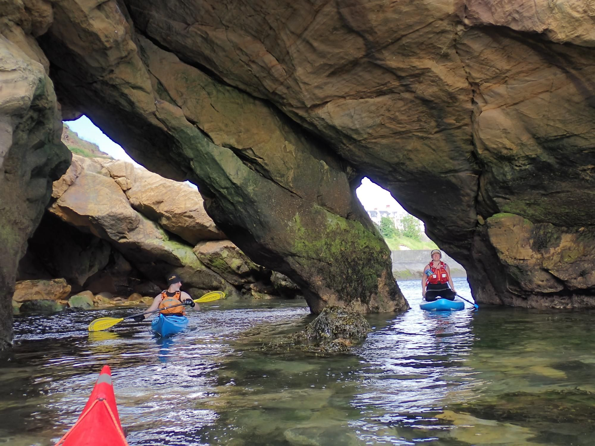

- Distance: 4.6 km

Took Gem & Ollie out for a paddle. It was forecast F3 offshore so I was hestiant about letting Ollie borrow the SUP - but when we arrived at Cullercoats early on Saturday morning, the wind had dropped to almost nothing. They swtiched who paddled the kayak and who was on the SUP. Gemma saw dolphins and we went through the cave a few times. We had to rush off the water to get to Renza's 2nd birthday party. I bumped into Phil and Will on the carry up the hill.

