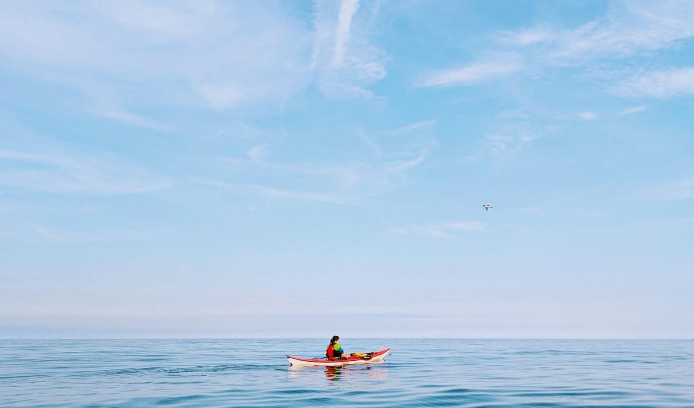

- Distance: 10.8 km

Lovely after-work paddle on a warm, still summer evening. Flat calm seas most of the way, with a bit of baby surf at Longsands to play in. Mark had me practising my roll which helped build some confidence.

Gayle, Paul and I headed straight back while the rest of the group continued along the coast. Went for chips afterwards, but the chippy had run out.

Out with Paul, Gayle, Mark, Kev, Phil, Andy, Gordon and Kevin.

📸: Gayle

