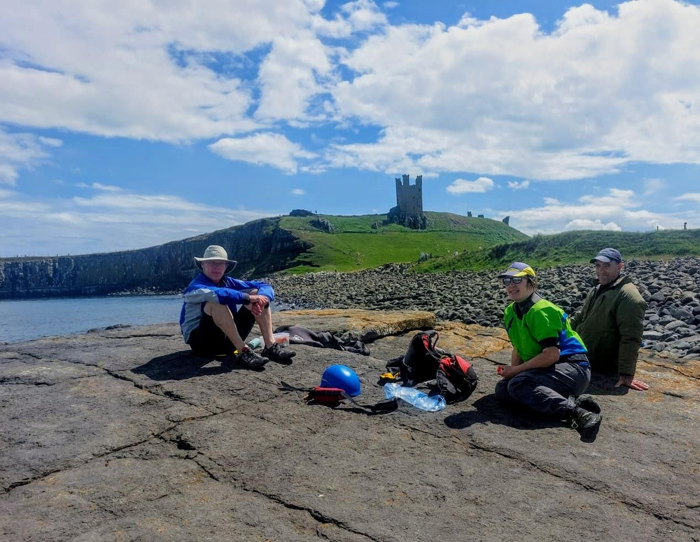

- Distance: 19.9 km

The CC Farnes trip was cancelled because of the wind, but I headed out with Cumbrian friends Chris, Clare and Dan anyway. We launched straight from the campsite into an F4 headwind. Plenty of chatting and catching up made the miles disappear.

Lunch below Dunstanburgh castle, then a leisurely loop past the caves, watching kittiwakes, guillemots and puffins. With the wind behind us on the return, we flew north before stopping at Football Hole for a lovely swim. We made sure to give the nesting ringed plovers plenty of space.

We finished with a nosy around Beadnell Harbour beneath the old lime kiln, then back to the campsite for tea and scones. 😋

