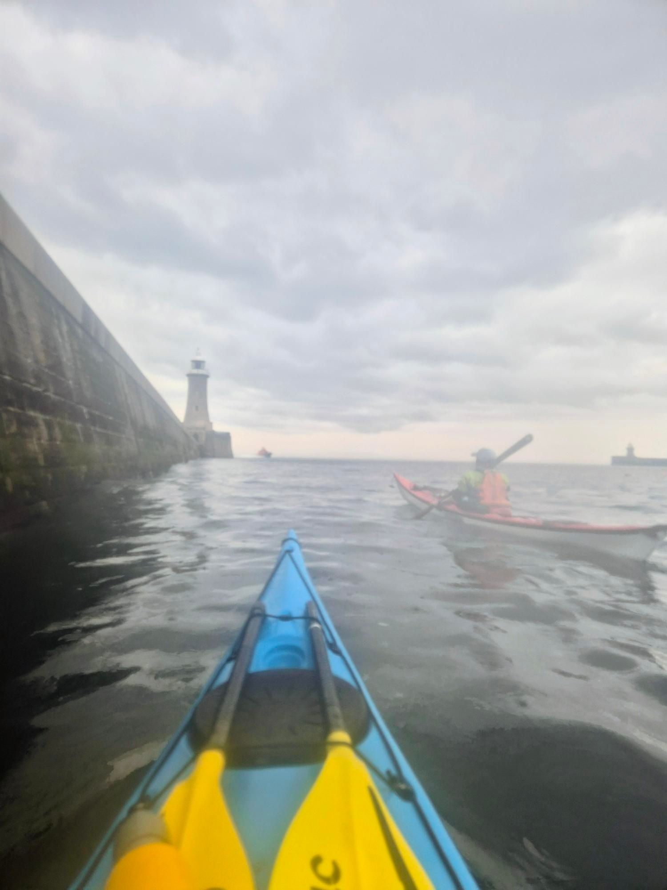

- Distance: 8.2 km

After bailing on yesterday's paddle due to the threat of lightening - Sarah and I were keen to get out (whilst everyone else watched the England match).

It was super calm seas as we rounded the piers in the rain, avoiding the kids fishing off end.

Chatty paddle across to Cullercoats where we bumped into Gordon & Josh. We did some rolling practice. I managed one roll when I successfully stayed on the back deck. I got a bit more confident trying rolls with Sarah there to rescue me and my cap.

By the time we got back around the pier the Tyne was totally different to when we left it. Lots of clapotis lead to a bumpy ride back the Haven.

Finished the evening with a hot chocolate and a chat with Tim at the club.

