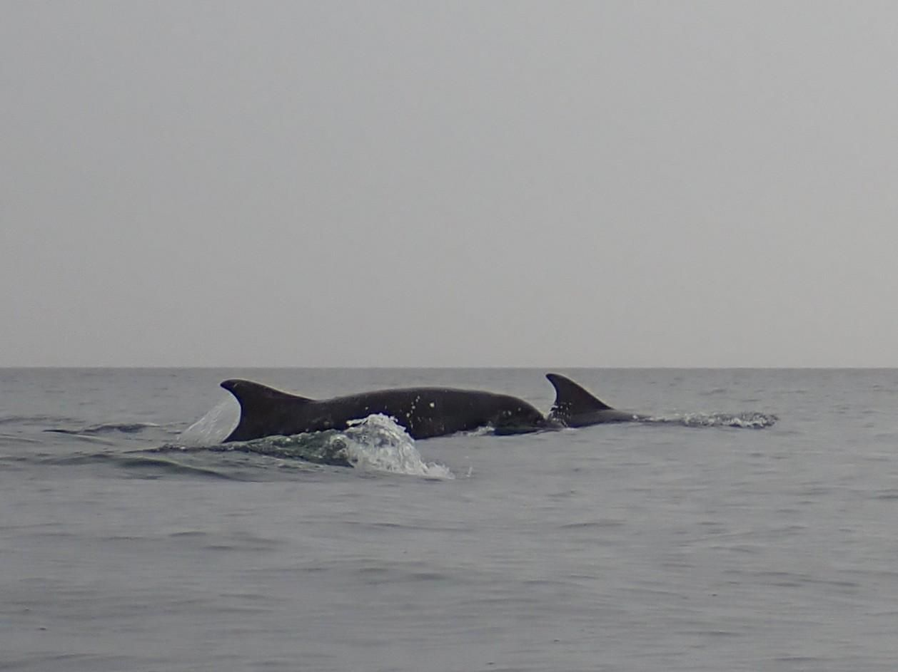

- Distance: 15.5 km

Friday night paddle with Kirstie. Jet skis were out buzzing the vessels in the Tyne, cutting infront of incoming traffic and generally just being radgies.

Saw a pod of about 8 bottle nose dolphins near Souter point, including Emel (#18).

On the way back we saw a different pod much further out. Potentially white beaked dolphins by the look of their side breaching.

